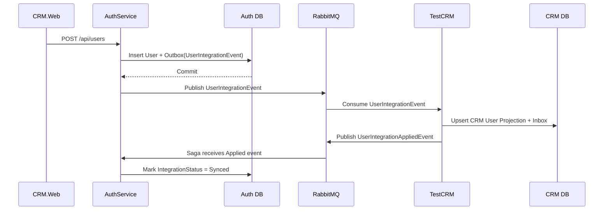
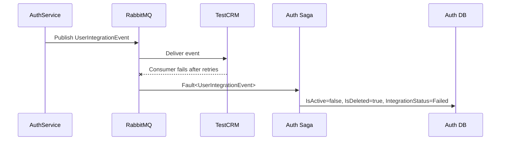

# TestCRM Architecture - Strategic DDD View

این سند معماری سیستم `TestCRM` را با مفاهیم Strategic DDD توصیف می‌کند. هدف این است که مالکیت مدل‌ها، مرز Contextها، نوع ارتباط سرویس‌ها و جریان رخدادها شفاف باشد.

## Solution Overview

| Project | Type | Role |
|---|---|---|
| `AuthService` | ASP.NET Core 8 | مالک هویت، کاربر، tenant، claim، نقش و token |
| `TestCRM` | ASP.NET Core 8 | مالک قابلیت‌های CRM مثل Account, Contact, Lead, Opportunity, Ticket, Activity |
| `CRM.Web` | Blazor Server | UI مشترک برای Auth و CRM |
| `Shared` | Class Library | قراردادهای مشترک، eventها، DTOها، base typeها و سرویس‌های عمومی |

## Domain

### Core Domain

Core Domain اصلی سیستم، مدیریت فرآیندهای CRM است. این بخش مستقیماً ارزش اصلی محصول را تولید می‌کند.

در این پروژه، Core Domain در سرویس `TestCRM` قرار دارد:

- Account Management
- Contact Management
- Lead Management
- Opportunity Management
- Ticket Management
- Activity Management
- Tenant-scoped CRM data isolation

نکته مهم: `User` در مدل CRM مالکیت اصلی ندارد. CRM فقط در صورت نیاز یک projection/reference محلی از user نگه می‌دارد تا بتواند assigned user، audit، owner یا نمایش نام کاربر را انجام دهد.

### Supporting Domain

Supporting Domainها قابلیت‌هایی هستند که برای Core Domain ضروری‌اند، اما خودشان ارزش اصلی CRM نیستند.

در این سیستم:

- `AuthService`: احراز هویت، صدور JWT، مدیریت کاربران، نقش‌ها، claimها و tenantها
- Service Instance Management: نگاشت tenant به CRM instance
- MassTransit Integration: sync بین Auth و CRM با Outbox/Inbox/Saga

AuthService برای سیستم حیاتی است، اما از نگاه محصول CRM، پشتیبان Core Domain محسوب می‌شود. البته داخل bounded context خودش، Identity/Auth می‌تواند core model مستقل خودش را داشته باشد.

### Generic Domain

Generic Domainها قابلیت‌های عمومی و قابل‌جایگزینی هستند:

- SQL Server persistence
- EF Core migrations
- JWT token technical validation
- Swagger/OpenAPI
- MudBlazor UI components
- Logging
- Rate limiting
- RabbitMQ transport

این قسمت‌ها نباید منطق اختصاصی CRM یا Auth را در خودشان نگه دارند.

## Bounded Context

### تعریف

Bounded Context مرزی است که داخل آن یک مدل معنی دقیق و معتبر دارد. یک واژه در دو Context مختلف می‌تواند معنای متفاوتی داشته باشد.

مثلاً `User` در AuthService یعنی:

- username
- password hash
- role
- claims
- tenant membership
- login identity

اما در TestCRM اگر وجود داشته باشد، فقط یعنی:

- reference/projection از user احراز هویت شده
- نام، ایمیل، نقش نمایشی
- شناسه Auth user برای ارتباط با داده‌های CRM

پس این دو مدل یکی نیستند و نباید یک entity مشترک واقعی باشند.

### مرزبندی Contextها

#### Auth Context

Project: `AuthService`

مالکیت:

- User
- Credential
- Role
- Claim
- Tenant
- ServiceInstance
- Login / Refresh Token
- User integration saga state

قوانین:

- فقط AuthService حق ایجاد، ویرایش و حذف user واقعی را دارد.
- password یا password hash نباید از AuthService به CRM منتقل شود.
- صفحه Users باید API AuthService را صدا بزند.
- AuthService پس از تغییر user، event استاندارد منتشر می‌کند.

#### CRM Context

Project: `TestCRM`

مالکیت:

- Account
- Contact
- Lead
- Opportunity
- Ticket
- Activity
- CRM-local user projection/reference

قوانین:

- CRM نباید user واقعی بسازد.
- CRM نباید password یا credential نگه دارد.
- CRM فقط از `UserIntegrationEvent` برای ساخت یا به‌روزرسانی projection استفاده می‌کند.
- همه داده‌های CRM باید با `TenantId` جدا شوند.
- soft delete با `IsDeleted` انجام می‌شود.

#### Web/UI Context

Project: `CRM.Web`

مالکیت:

- UI state
- صفحه login
- صفحه‌های CRM
- صفحه Users که مستقیماً Auth API را صدا می‌زند

قوانین:

- برای login و user management از AuthService استفاده می‌کند.
- برای entityهای CRM از TestCRM API استفاده می‌کند.
- API URL بعد از login از tenant/service instance تعیین می‌شود.

#### Shared Kernel / Contracts Context

Project: `Shared`

مالکیت:

- Contractهای مشترک
- Integration Eventها
- DTOهای بین سرویس‌ها
- Base abstractions

قوانین:

- فقط چیزهایی در `Shared` قرار می‌گیرند که واقعاً بین Contextها قرارداد مشترک هستند.
- business rule اختصاصی Auth یا CRM نباید وارد Shared شود.
- تغییر در Shared باید با احتیاط انجام شود چون چند Context را همزمان تحت تاثیر قرار می‌دهد.

### استقلال Contextها

هر Context دیتابیس و مدل خودش را دارد:

- AuthService DB: کاربران، tenantها، service instanceها، tokenها، saga stateها
- TestCRM DB: داده‌های CRM و projectionهای محلی

ارتباط مستقیم دیتابیسی بین Contextها ممنوع است. ارتباط باید از طریق API یا event contract انجام شود.

## Context Map

### AuthService -> TestCRM

الگوی اصلی ارتباط:

- Open Host Service
- Published Language
- Customer/Supplier
- Anti-Corruption Layer سبک در CRM consumer

توضیح:

AuthService مالک user است و event رسمی منتشر می‌کند. TestCRM مصرف‌کننده است و مدل خودش را از روی event می‌سازد.

Published Language:

- `UserIntegrationEvent`
- `UserIntegrationAppliedEvent`
- `UserIntegrationOperation`

این eventها زبان رسمی بین Auth و CRM هستند.

### CRM.Web -> AuthService

الگو:

- Customer/Supplier
- Open Host Service

توضیح:

`CRM.Web` برای login، tenant switching و user management از API رسمی AuthService استفاده می‌کند.

### CRM.Web -> TestCRM

الگو:

- Customer/Supplier
- Open Host Service

توضیح:

`CRM.Web` برای entityهای CRM مثل contacts, accounts, tickets از API رسمی TestCRM استفاده می‌کند.

### AuthService <-> Shared

الگو:

- Shared Kernel
- Published Language

توضیح:

AuthService از contractهای مشترک داخل `Shared` استفاده می‌کند. این اشتراک باید کوچک و پایدار بماند.

### TestCRM <-> Shared

الگو:

- Shared Kernel
- Published Language

توضیح:

TestCRM از eventها و base abstractionهای مشترک استفاده می‌کند، ولی business model خودش را مستقل نگه می‌دارد.

### AuthService و TestCRM از نظر مدل User

الگوی مناسب:

- مدل‌ها متفاوت‌اند، پس Partnership یا entity مشترک مناسب نیست.
- AuthService مالک اصلی است.
- TestCRM باید Separate Model داشته باشد.
- مصرف event در CRM نقش Anti-Corruption Layer را دارد.

قاعده:

هرچه مدل‌ها متفاوت‌تر باشند، باید به سمت ACL و Separate Model رفت. در این پروژه `Auth User` و `CRM User Projection` یکسان نیستند، پس Shared Entity یا Partnership انتخاب درستی نیست.

## Context Relationship Patterns

### Partnership

در این سیستم برای User استفاده نمی‌شود، چون Auth و CRM مالک مشترک User نیستند.

### Shared Kernel

استفاده شده در:

- `Shared`
- event contracts
- DTOهای مشترک
- base abstractions

قانون:

Shared Kernel باید کوچک بماند. اگر یک مدل behavior اختصاصی دارد، نباید وارد Shared شود.

### Customer/Supplier

استفاده شده در:

- `CRM.Web` مصرف‌کننده AuthService API
- `CRM.Web` مصرف‌کننده TestCRM API
- `TestCRM` مصرف‌کننده eventهای AuthService

### Conformist

برای User نباید استفاده شود. CRM نباید کل مدل User در Auth را بپذیرد، چون credential و identity concern متعلق به CRM نیست.

### Anti-Corruption Layer

در `TestCRM/Application/Consumers/UserIntegrationConsumer.cs` وجود دارد.

این consumer پیام Auth را به projection داخلی CRM ترجمه می‌کند.

### Open Host Service

استفاده شده در:

- AuthService REST API
- TestCRM REST API
- AuthService gRPC token validation

### Published Language

استفاده شده در:

- `Shared.Contracts.Events`
- `Shared.Contracts.Auth`
- Integration eventها

### Separate Ways

برای Contextهایی مناسب است که هیچ نیاز ارتباطی ندارند. در این سیستم بیشتر Contextها ارتباط دارند، اما بعضی generic concerns مثل UI styling یا Swagger می‌توانند جدا باشند.

## User Integration Flow

اگر CRM در پردازش event خطا بدهد:

## Event Storming

### Orange Events

رخدادهای مهم دامنه:

- UserCreatedInAuth
- UserUpdatedInAuth
- UserDeletedInAuth
- UserIntegrationEventPublished
- UserProjectionCreatedInCRM
- UserProjectionUpdatedInCRM
- UserProjectionDeletedInCRM
- UserIntegrationApplied
- UserIntegrationFailed
- AccountCreated
- ContactCreated
- LeadCreated
- OpportunityCreated
- TicketCreated
- TicketClosed
- ActivityCompleted

### Blue Commands

دستورهای اصلی:

- Login
- RegisterUser
- CreateUser
- UpdateUser
- DeleteUser
- SwitchTenant
- CreateAccount
- CreateContact
- CreateLead
- CreateOpportunity
- CreateTicket
- CloseTicket
- CreateActivity
- CompleteActivity

### Green Policies

Policyها یا واکنش‌های خودکار:

- وقتی user در Auth ساخته شد، `UserIntegrationEvent` منتشر شود.
- وقتی CRM event را مصرف کرد، projection ساخته یا به‌روز شود.
- وقتی CRM موفق شد، `UserIntegrationAppliedEvent` منتشر شود.
- وقتی CRM شکست خورد، Saga رکورد Auth user را failed و logical delete کند.
- وقتی کاربر login کرد، tenant فعال و service instance او مشخص شود.
- وقتی tenant تغییر کرد، API URL متناسب با service instance جدید تنظیم شود.

### Purple Read Models

Read Modelهای مهم:

- Users page model از AuthService
- CRM user projection در TestCRM
- Dashboard ticket status chart
- Dashboard ticket priority chart
- Ticket due date timeline
- Account list
- Contact list
- Lead pipeline list
- Opportunity board/list

### Aggregate Discovery

قاعده:

اگر چند مدل باید در یک transaction تغییر کنند، معمولاً یک aggregate boundary مشترک دارند.

در این سیستم:

- در AuthService، `AppUser` aggregate اصلی برای identity است.
- تغییر user و ذخیره outbox message در یک transaction انجام می‌شود، اما CRM projection در همان transaction نیست.
- بین AuthService و TestCRM از distributed transaction استفاده نمی‌شود.
- consistency بین Auth و CRM از نوع eventual consistency است.
- Saga وضعیت فرآیند بین Contextها را مدیریت می‌کند.

نمونه aggregateها:

| Aggregate | Context | دلیل |
|---|---|---|
| `AppUser` | AuthService | credential, role, claim, tenant membership |
| `Tenant` | AuthService | tenant identity and service instance assignment |
| `Account` | TestCRM | customer/company record |
| `Contact` | TestCRM | person/customer contact |
| `Ticket` | TestCRM | support workflow with status and priority |
| `Opportunity` | TestCRM | sales opportunity lifecycle |

## Design Rules

- User واقعی فقط در AuthService ساخته می‌شود.
- TestCRM فقط projection/reference از user دارد.
- password و password hash هرگز وارد TestCRM نمی‌شود.
- ارتباط بین Auth و CRM از طریق Published Language انجام می‌شود.
- eventها در `Shared.Contracts.Events` تعریف می‌شوند.
- Outbox برای از دست نرفتن پیام استفاده می‌شود.
- Inbox برای idempotency و جلوگیری از duplicate processing استفاده می‌شود.
- Saga برای مدیریت workflow و failure بین Contextها استفاده می‌شود.
- اگر مدل دو Context متفاوت است، shared entity نساز؛ ACL یا projection بساز.
